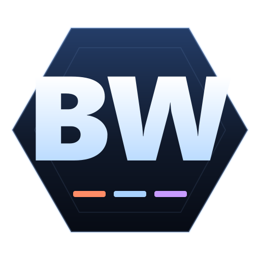

# BW Build Overlay Suite

[](https://github.com/Etra-0/starcraft-build-overlay/actions/workflows/ci.yml)
[](https://github.com/Etra-0/starcraft-build-overlay/releases/latest)
[](LICENSE)

An always-on-top desktop overlay that shows StarCraft: Brood War / Remastered build orders, with a built-in Liquipedia importer and update scanner. Native bundles for **Windows, macOS, and Linux**. Covers all three races (Terran, Protoss, Zerg) and all nine matchups.



> **Run StarCraft in Windowed (Fullscreen) mode.** True/exclusive fullscreen hides every other window — including this overlay. In **Options > Graphics**, set the display mode to **Windowed (Fullscreen)** (sometimes labelled "Borderless Windowed"). The overlay then sits on top of the game correctly.

## Highlights

- All 9 matchups (TvT/TvP/TvZ, PvT/PvP/PvZ, ZvT/ZvP/ZvZ) with race-themed colors.
- Build orders shown as a clean paginated list — no per-step "click next".
- Liquipedia `{{build}}` template-aware importer, including multi-variant pages.
- "Check for updates" against Liquipedia for everything you've imported.
- Manual builds with personal notes that survive re-imports.
- Search, favorites, compact mode, opacity slider, global hotkeys.
- Built on **Tauri 2 + Rust**: native installers under ~10 MB. WebView2 / WKWebView / WebKitGTK provide the UI runtime.
- Custom app icon, auto-opening DevTools in dev mode, F12 / Ctrl+Shift+I toggle anywhere.

---

## Table of contents

- [For end users](#for-end-users)
  - [Download](#download)
  - [Hotkeys](#hotkeys)
  - [Build Manager](#build-manager)
  - [Debug mode](#debug-mode)
  - [Data location](#data-location)
- [For developers](#for-developers)
- [Releasing](#releasing)
- [Project layout](#project-layout)
- [Schema](#schema)
- [Troubleshooting](#troubleshooting)
- [License](#license)

---

## For end users

Just want to use the overlay? You don't need any toolchain.

### Download

Open the [latest release](https://github.com/Etra-0/starcraft-build-overlay/releases/latest) and pick the right file for your OS:

| OS      | Recommended                                              | Alternative                                                          |
| ------- | -------------------------------------------------------- | -------------------------------------------------------------------- |
| Windows | `BW-Build-Overlay_<version>_x64-setup.exe` (NSIS)        | `BW-Build-Overlay_<version>_x64_en-US.msi`                           |
| macOS   | `BW-Build-Overlay_<version>_universal.dmg` (Intel + ARM) | `BW-Build-Overlay.app.tar.gz`                                        |
| Linux   | `BW-Build-Overlay_<version>_amd64.AppImage`              | `bw-build-overlay_<version>_amd64.deb` (needs `libwebkit2gtk-4.1-0`) |

Launch the app. The overlay window stays on top of StarCraft. Click **Manage > Import** to fetch builds from Liquipedia, or **New manual build** to add your own.

> **Set StarCraft to Windowed (Fullscreen).** In SC:R, open **Options > Graphics** and set Display Mode to **Windowed (Fullscreen)** (a.k.a. Borderless Windowed). True/exclusive fullscreen will hide the overlay; Windowed (Fullscreen) looks identical and lets the overlay stay on top.

#### Platform notes

- **Windows.** WebView2 is pre-installed on Windows 10 21H2+ and Windows 11. The installer bundles the WebView2 bootstrapper for older systems. SmartScreen may warn the first time you run the EXE because it isn't code-signed — click "More info" → "Run anyway".
- **macOS.** The `.app` is **not code-signed or notarized**. Gatekeeper will refuse the first launch. Right-click the app → **Open** → **Open** in the dialog, or run `xattr -d com.apple.quarantine /Applications/"BW Build Overlay.app"` once.
- **Linux.** The AppImage is self-contained — `chmod +x` and run. The `.deb` requires `libwebkit2gtk-4.1-0` (`sudo apt install libwebkit2gtk-4.1-0`).

### Hotkeys

| Hotkey                 | Action                                     |
| ---------------------- | ------------------------------------------ |
| Ctrl+Alt+1 / 2 / 3     | Player race: Terran / Protoss / Zerg       |
| Ctrl+Alt+Q / W / E / R | Opponent: Terran / Zerg / Protoss / Random |
| Ctrl+Alt+B             | Next build in current matchup              |
| Ctrl+Alt+Shift+B       | Previous build                             |
| Ctrl+Alt+PgDn / PgUp   | Next / previous page of long builds        |
| Ctrl+Alt+0             | Jump to page 1                             |
| Ctrl+Alt+F             | Toggle favorite on current build           |
| Ctrl+Alt+C             | Toggle compact mode                        |
| Ctrl+Alt+H             | Hide / show overlay                        |
| `/` (in overlay)       | Focus the build search                     |
| F12 / Ctrl+Shift+I     | Toggle DevTools (debug log)                |

### Build Manager

Click **Manage** to open the modal. Tabs:

- **Edit** — manually create or edit a build (id, race, opponent, difficulty, tags, steps, notes). Saving auto-marks the build as `customEdited` so subsequent imports won't overwrite it.
- **Import** — paste a Liquipedia URL or page title, or run a bulk category import per race. Multi-variant pages produce one build per variant.
- **Updates** — scan all your Liquipedia-sourced builds for newer wiki revisions, then refresh selected ones in batches. `customEdited` builds are skipped unless forced.
- **Settings** — Liquipedia User-Agent, request rate limit, compact mode, window opacity, page size, default race.

### Debug mode

If something looks broken (overlay frozen, click does nothing, import errors, etc.), open DevTools to see what's happening:

- **Press `F12` or `Ctrl+Shift+I`** anywhere in the app — DevTools toggles in any build.
- Set the env var `BW_DEVTOOLS=1` before launching to auto-open DevTools on startup. Useful when filing bug reports:
  ```powershell
  # Windows
  $env:BW_DEVTOOLS = "1"
  & "$env:ProgramFiles\BW Build Overlay\BW Build Overlay.exe"
  ```
  ```bash
  # macOS / Linux
  BW_DEVTOOLS=1 "BW Build Overlay"
  ```
- The Console tab shows logs (`[bw-overlay] renderer booted` confirms the renderer started). The Network tab shows Liquipedia requests.
- If the renderer fails to boot, a red banner appears at the top of the overlay window with the error.

When filing a bug, please attach the DevTools console output as a screenshot or copy-paste.

### Data location

Your imported builds, settings, and backups live in your OS-specific user-data folder. Tauri uses the bundle identifier (`com.local.bwbuildoverlay`) for the directory name:

| OS      | Path                                                                 |
| ------- | -------------------------------------------------------------------- |
| Windows | `%APPDATA%\com.local.bwbuildoverlay\`                                |
| macOS   | `~/Library/Application Support/com.local.bwbuildoverlay/`            |
| Linux   | `~/.local/share/com.local.bwbuildoverlay/` (or `$XDG_DATA_HOME/...`) |

Each folder contains:

- `builds.json` — your build library.
- `settings.json` — overlay opacity, rate limit, default race, etc.
- `builds-backup-*.json` — timestamped backups produced by **Manage > Backup builds.json**.

Use **Manage > Open data folder** to open the directory in your file manager.

---

## For developers

### Prerequisites

- **Node 24 LTS** (the repo includes a [`.nvmrc`](.nvmrc); `nvm use` will pick the right version on systems with [nvm](https://github.com/nvm-sh/nvm) or [nvm-windows](https://github.com/coreybutler/nvm-windows)).
- **npm 11+** (ships with Node 24).
- **Rust 1.85+** via [`rustup`](https://rustup.rs/) — the [`rust-toolchain.toml`](rust-toolchain.toml) at the repo root pins `stable` and adds `clippy` + `rustfmt` automatically on first `cargo` invocation.
- **OS-specific Tauri build deps:**
  - **Windows:** Microsoft Visual C++ Build Tools (Workload "C++ build tools" — installed by `rustup-init` on Windows when prompted). WebView2 is pre-installed on Win10 21H2+ and Win11.
  - **macOS:** Xcode Command Line Tools (`xcode-select --install`).
  - **Linux:** `libwebkit2gtk-4.1-dev`, `libgtk-3-dev`, `libsoup-3.0-dev`, `libjavascriptcoregtk-4.1-dev`, `libayatana-appindicator3-dev`, `librsvg2-dev`. See [the Tauri prereqs page](https://v2.tauri.app/start/prerequisites/#linux) for the apt/dnf/pacman one-liner.

Verify:

```bash
node --version   # v24.x
npm --version    # 11.x or newer
rustc --version  # 1.85 or newer
cargo --version
```

### Quick start

```bash
git clone https://github.com/Etra-0/starcraft-build-overlay.git
cd starcraft-build-overlay
npm install
npm run dev
```

`npm run dev` (which is just `npm run tauri:dev`):

1. `esbuild --watch` rebuilds the renderer bundle into `dist-frontend/` on every `src/renderer/` change.
2. `npx tauri dev` builds and launches the Rust backend with `BW_DEVTOOLS=1` so DevTools auto-opens.

Renderer changes hot-reload on save. **Rust changes trigger a recompile + relaunch** (Tauri handles this automatically).

### Available scripts

| Script                                    | What it does                                                                                                                                                |
| ----------------------------------------- | ----------------------------------------------------------------------------------------------------------------------------------------------------------- |
| `npm run dev` / `npm run tauri:dev`       | Watch builds + Tauri with DevTools auto-open.                                                                                                               |
| `npm run dev:renderer`                    | Just the esbuild watch for the renderer bundle (writes to `dist-frontend/`).                                                                                |
| `npm run build:renderer`                  | One-shot renderer build → `dist-frontend/renderer.js` + static assets.                                                                                      |
| `npm run tauri:build`                     | Production build of the renderer + Tauri bundle for the host OS.                                                                                            |
| `npm run dist`                            | Alias for `npm run tauri:build` (NSIS/MSI on Windows, DMG/.app on macOS, AppImage/.deb on Linux).                                                           |
| `npm run dist:win` / `:mac` / `:linux`    | Build only the bundles for that OS family (still has to run on the corresponding host — Tauri does not cross-compile bundles).                              |
| `npm run typecheck`                       | TypeScript type-only check for the renderer (`tsconfig.renderer.json`).                                                                                     |
| `npm run lint` / `npm run lint:fix`       | ESLint (flat config; `eslint.config.mjs` selects `**/*.ts`).                                                                                                |
| `npm run format` / `npm run format:check` | Prettier write / check.                                                                                                                                     |
| `npm test`                                | `cargo test --manifest-path src-tauri/Cargo.toml` — runs all 19 Rust unit tests (storage, parser, importer, utils).                                         |
| `npm run clean`                           | Delete `dist-frontend/` and `src-tauri/target/`.                                                                                                            |
| `npm run size`                            | Print the size (MB) of the latest bundle artifacts under `src-tauri/target/release/bundle/`.                                                                |
| `npm run release:patch \| minor \| major` | Bump version (`package.json`, `Cargo.toml`, `tauri.conf.json`), rotate `CHANGELOG.md`, refresh `Cargo.lock`, commit, and tag (see [Releasing](#releasing)). |

### How the build works

```
src/renderer/*.ts      ──esbuild──>  dist-frontend/renderer.js  (single ESM bundle)
index.html, styles.css ─────cp─────>  dist-frontend/             (static assets)
assets/icon.png        ─────cp─────>  dist-frontend/

src-tauri/src/*.rs     ──cargo build──>  src-tauri/target/release/bw-build-overlay
src-tauri/icons/*       ──tauri bundle──>  src-tauri/target/release/bundle/
                                             ├── nsis/   (Windows .exe installer)
                                             ├── msi/    (Windows .msi)
                                             ├── dmg/    (macOS .dmg)
                                             ├── macos/  (macOS .app)
                                             ├── appimage/  (Linux .AppImage)
                                             └── deb/    (Linux .deb)
```

The `frontendDist` field in [`src-tauri/tauri.conf.json`](src-tauri/tauri.conf.json) points at `../dist-frontend`. Tauri reads HTML/JS/CSS from there at runtime in dev, and embeds them into the resulting bundle in release. There's no Chromium download — the OS-bundled WebView (WebView2 on Windows, WKWebView on macOS, WebKitGTK on Linux) renders the UI.

The renderer is bundled (rather than just transpiled) because the WebView runs the renderer in a sandboxed browser context with no Node integration — `require()` / `import.meta.url` to filesystem paths aren't available. esbuild produces one self-contained ESM file.

### Cleaning and rebuilding from scratch

The `dist-frontend/` and `src-tauri/target/` folders are git-ignored and regenerated on every build:

```bash
npm run clean       # deletes dist-frontend/ and src-tauri/target/
npm install         # if you blew away node_modules too
npm run tauri:build
```

The bundle artifacts under `src-tauri/target/release/bundle/<format>/` are your shippable outputs.

---

## Releasing

Versioning follows [Semantic Versioning](https://semver.org/): `MAJOR.MINOR.PATCH`.

### Where the version lives

The single source of truth is the `version` field in [package.json](package.json). The release script propagates it to:

- [`src-tauri/Cargo.toml`](src-tauri/Cargo.toml) `[package].version` (and `Cargo.lock`).
- [`src-tauri/tauri.conf.json`](src-tauri/tauri.conf.json) `.version`.
- The GitHub Release tag (`vX.Y.Z`).
- Bundle filenames (`BW-Build-Overlay_X.Y.Z_x64-setup.exe`, `BW-Build-Overlay_X.Y.Z_universal.dmg`, etc.).
- The default User-Agent the Liquipedia importer sends (sourced from `CARGO_PKG_VERSION` at compile time).

### Cutting a release

1. Edit `## [Unreleased]` in [CHANGELOG.md](CHANGELOG.md) with the user-visible changes for this version (Added / Changed / Fixed / Removed).
2. Run one of:
   ```bash
   npm run release:patch   # 1.0.0 -> 1.0.1   (bug fixes)
   npm run release:minor   # 1.0.0 -> 1.1.0   (new features, backwards compatible)
   npm run release:major   # 1.0.0 -> 2.0.0   (breaking changes / data migrations)
   ```
   This script bumps `package.json` + `Cargo.toml` + `tauri.conf.json`, refreshes `Cargo.lock`, rotates the changelog (`Unreleased` becomes `[X.Y.Z] - YYYY-MM-DD` and a fresh `Unreleased` block is added on top), commits, and tags `vX.Y.Z`. Use `--dry-run` to see what would happen without changing anything.
3. Push:
   ```bash
   git push origin main --follow-tags
   ```
4. The [Release workflow](.github/workflows/release.yml) is a `windows-latest` × `macos-latest` × `ubuntu-latest` matrix that runs [`tauri-apps/tauri-action@v0`](https://github.com/tauri-apps/tauri-action). Each runner produces its native bundles (NSIS/MSI on Windows, universal DMG on macOS, AppImage/.deb on Linux) and uploads them to a draft GitHub Release named `BW Build Overlay <tag>`. Edit the body and publish when ready.

CI runs in two stages on every PR and push to `main` ([ci.yml](.github/workflows/ci.yml)):

- A `quality` job (Ubuntu) runs `format:check`, `lint`, `typecheck`, plus `cargo fmt --check`, `cargo clippy -- -D warnings`, and `cargo test`.
- A `package` matrix (`windows-latest` + `macos-latest` + `ubuntu-latest`) builds the renderer and runs `cargo build --tests` so platform-specific Rust regressions surface on PRs without paying for the full bundle build.

Dependency upgrades come in via [Dependabot](.github/dependabot.yml) on a weekly cadence.

---

## Project layout

```
src/
  shared/
    types.ts        OverlayAPI IPC contract + Build/Settings/Race types
    utils.ts        pure helpers (deriveMatchup, slugify, splitStep, ...)
  renderer/
    index.ts        renderer entry (bundled by esbuild into one ESM file)
    api.ts          @tauri-apps/api invoke/listen wrapper implementing OverlayAPI
    state.ts        in-memory state + localStorage
    dom.ts          typed element refs (Dom interface, byId<T> helper)
    toast.ts        non-blocking notifications
    overlay.ts      overlay rendering + paging
    manager.ts      Manager modal, build list
    edit-tab.ts     Edit tab form
    import-tab.ts   Import tab UI
    updates-tab.ts  Updates tab UI
    settings-tab.ts Settings tab UI
    hotkeys.ts      hotkey-event -> handler dispatch (typed HotkeyAction union)
src-tauri/
  Cargo.toml        Rust crate manifest, deps + release profile
  tauri.conf.json   window, identifier, bundle targets, CSP, frontendDist
  capabilities/     Tauri 2 permission manifests
  icons/            generated platform icons (don't hand-edit)
  src/
    main.rs         binary entry point (calls run() from lib.rs)
    lib.rs          Builder, plugin registration, app state, hotkey/window setup
    commands.rs     #[tauri::command] handlers — one per OverlayAPI method
    storage.rs      builds.json + settings.json I/O, schema migration
    window.rs       opacity, always-on-top keeper, devtools toggle, global shortcut registration
    types.rs        serde structs mirroring src/shared/types.ts
    utils.rs        Rust port of src/shared/utils.ts (deriveMatchup / slugify / splitStep)
    liquipedia/
      api.rs        rate-limited reqwest MediaWiki client
      parser.rs     {{build}} template parser, infobox, counters
      import.rs     single + bulk page import, merge logic
      updates.rs    revision check + refresh
dist-frontend/      esbuild + static-asset output [git-ignored]
src-tauri/target/   cargo build output                [git-ignored]
data/builds.json    seed library (all 9 matchups), embedded as a Tauri resource
assets/icon.png     icon source (icons/ are generated from this)
scripts/            build-renderer.mjs, dev.mjs, release.mjs, report-size.mjs
index.html          entrypoint that loads ./renderer.js
styles.css
tsconfig.renderer.json  typecheck config for the renderer (ESM, DOM)
rust-toolchain.toml     pins stable + clippy + rustfmt
```

## Liquipedia importer notes

The importer parses Liquipedia's `{{build|...}}` template directly (it looks for `*8 - Pylon` style bullet lines inside the template). Supports:

- Multi-variant pages (each section's `{{build}}` becomes a separate build, linked via `variantOf`).
- `{{Infobox strategy}}` for race / matchups / creator / popularizer.
- `==Counter To==` and `==Countered By==` lists (shown at the bottom of the build card).
- Difficulty tags from `Category:* Beginner/Intermediate/Advanced Strategy`.
- Per-build `revisionId` tracking, so the Updates tab can detect stale imports without re-downloading every page.

The importer respects Liquipedia's rate-limiting (default 2300 ms between requests). Configure your contact-able User-Agent in **Settings** before doing bulk imports.

## App icon

The icon source is `assets/icon.png` (square, ≥1024×1024). Tauri's CLI generates all platform-specific outputs from it:

```bash
npx tauri icon assets/icon.png
```

This regenerates everything under `src-tauri/icons/` — Windows `.ico`, macOS `.icns`, multiple PNG sizes, and Android/iOS variants. Tauri picks the right one for each bundle target automatically.

## Schema

Each build:

```jsonc
{
  "id": "pvt-1-gate-core",
  "race": "Protoss", // player race: Terran | Protoss | Zerg
  "opponent": "Terran", // Terran | Zerg | Protoss | Random
  "matchup": "PvT", // derived
  "name": "1 Gate Core",
  "variantOf": null, // parent build id when this came from a multi-variant page
  "tags": ["standard", "starter"],
  "difficulty": "beginner", // beginner | intermediate | advanced | null
  "sourceName": "Liquipedia",
  "sourceUrl": "https://liquipedia.net/starcraft/1_Gate_Core_(vs._Terran)",
  "sourcePageTitle": "1 Gate Core (vs. Terran)",
  "notes": "...", // imported description
  "userNotes": "", // your own notes; survives re-import
  "customEdited": false, // true => imports/refreshes skip this build
  "favorite": false,
  "recentlyUsedAt": null,
  "revisionId": 12345, // last seen Liquipedia revision id
  "lastImportedAt": "...",
  "lastCheckedAt": "...",
  "counters": ["..."],
  "counteredBy": ["..."],
  "steps": ["8 - Pylon", "10 - Gateway", "..."]
}
```

Schema migrations run automatically in [`src-tauri/src/storage.rs`](src-tauri/src/storage.rs) (`SCHEMA_VERSION` constant; currently `4`).

---

## Troubleshooting

| Symptom                                                        | Likely cause                                          | Fix                                                                                                                                                                              |
| -------------------------------------------------------------- | ----------------------------------------------------- | -------------------------------------------------------------------------------------------------------------------------------------------------------------------------------- |
| Overlay disappears the moment StarCraft starts                 | StarCraft running in true/exclusive fullscreen        | **Options > Graphics > Display Mode = Windowed (Fullscreen)**. Always-on-top windows can't sit above an exclusive-fullscreen Direct3D surface.                                   |
| Overlay drops behind the Windows taskbar after clicking it     | Known Tauri 2 always-on-top regression                | The app re-applies always-on-top on focus loss; if it persists, hit Ctrl+Alt+H twice to toggle, or relaunch.                                                                     |
| `npm run tauri:dev` fails with "linker `link.exe` not found"   | MSVC C++ Build Tools missing on Windows               | Re-run `rustup-init` and accept the MSVC toolchain prompt, or install Visual Studio's "Desktop development with C++" workload manually.                                          |
| `npm run tauri:dev` fails with "webkit2gtk not found" on Linux | Missing Tauri prereqs                                 | `sudo apt install libwebkit2gtk-4.1-dev libgtk-3-dev libsoup-3.0-dev libjavascriptcoregtk-4.1-dev libayatana-appindicator3-dev librsvg2-dev` (or the `dnf`/`pacman` equivalent). |
| macOS launch is blocked: "BW Build Overlay" can't be opened    | Unsigned `.app` quarantined by Gatekeeper             | Right-click → Open → Open, or `xattr -d com.apple.quarantine /Applications/"BW Build Overlay.app"`.                                                                              |
| Overlay opens but clicks do nothing                            | Renderer bundle stale (rebuilt Rust but not renderer) | `npm run build:renderer` and relaunch.                                                                                                                                           |
| Liquipedia importer returns "HTTP 429" or "rate limited"       | Too-fast requests                                     | Bump **Settings > Rate limit (ms)** to 3000+ and retry.                                                                                                                          |
| Built bundle launches and closes instantly                     | Crash on startup                                      | Set `BW_DEVTOOLS=1` and re-launch — DevTools console will show the error.                                                                                                        |
| GitHub release didn't get bundles for one of the OSes          | One matrix runner failed                              | Open the failed [Release workflow run](https://github.com/Etra-0/starcraft-build-overlay/actions/workflows/release.yml) and read the build log for that runner.                  |

---

## License

MIT — see [LICENSE](LICENSE).

## Support

- File bugs / feature requests in the [GitHub issue tracker](https://github.com/Etra-0/starcraft-build-overlay/issues).
- Include OS, version, reproduction steps, expected behavior, and screenshots when relevant.
- For renderer issues, please attach the DevTools console (F12) output.
